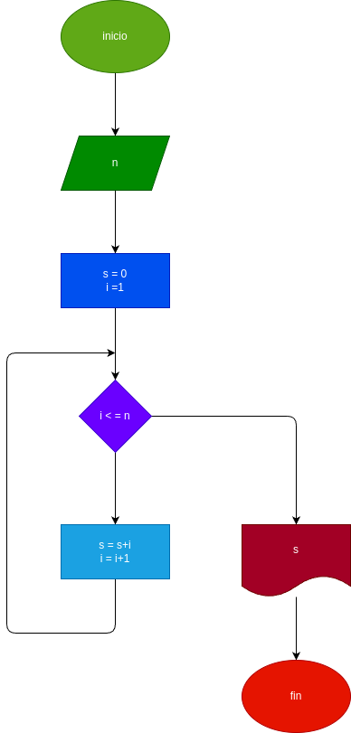

# while_1
Uso de la estructura de control "while" en Python

# Analisis
Este repositorio contiene un ejemplo de uso de la estructura de control "while" en Python, basado en el diagrama de flujo proporcionado. La estructura "while" permite repetir un bloque de código mientras una condición determinada sea verdadera.

## Imput
# Processing

El programa realiza la suma de los primeros "n" números naturales utilizando un ciclo "while".

Lógica del Algoritmo

Se inicia el programa.

Se solicita un valor "n" al usuario.

Se inicializan las variables "s" en 0 e "i" en 1.

Se evalúa si "i" es menor o igual a "n".

Si es verdadero, se suma "i" a "s" y se incrementa "i" en 1.

Si es falso, se finaliza el ciclo y se muestra el resultado.

Se muestra la suma total de los primeros "n" números naturales.

Fin del programa.
## output
se muestra el resultado 

### Diseño

